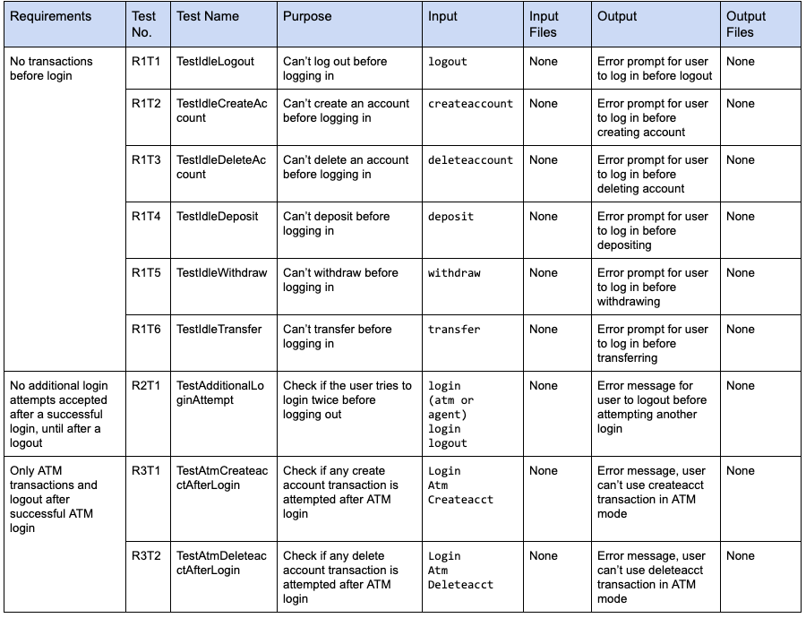
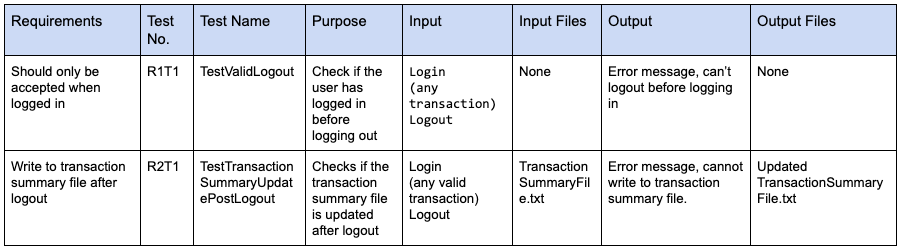
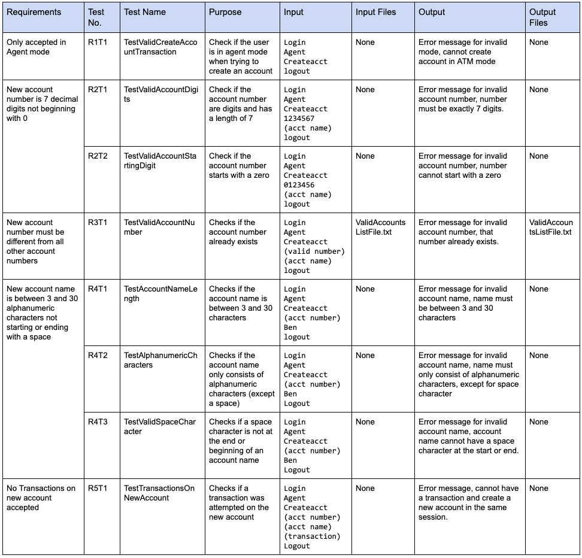
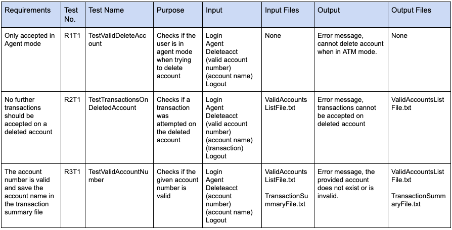
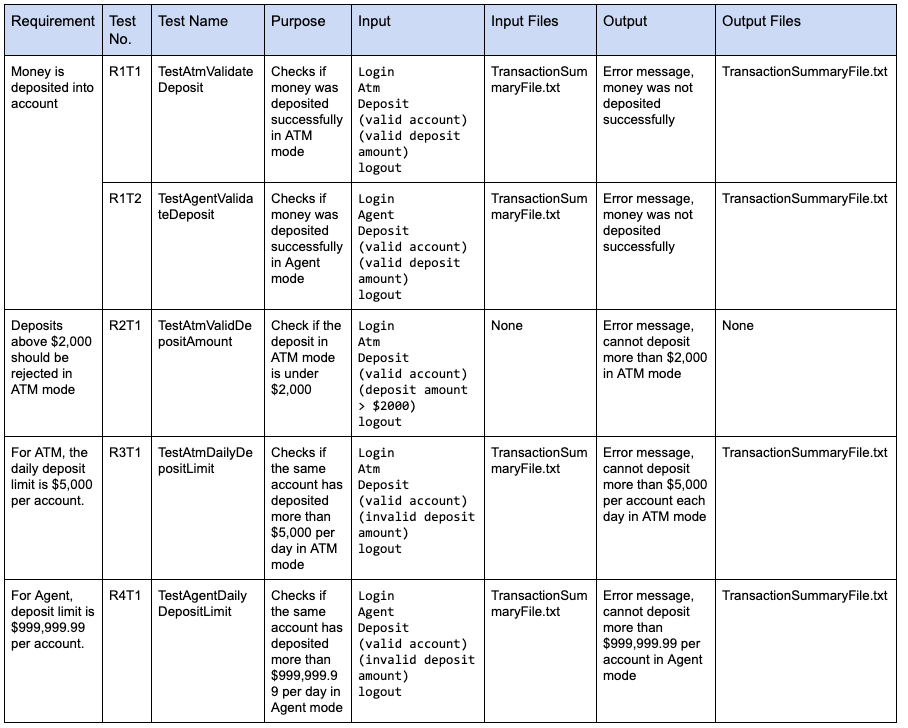
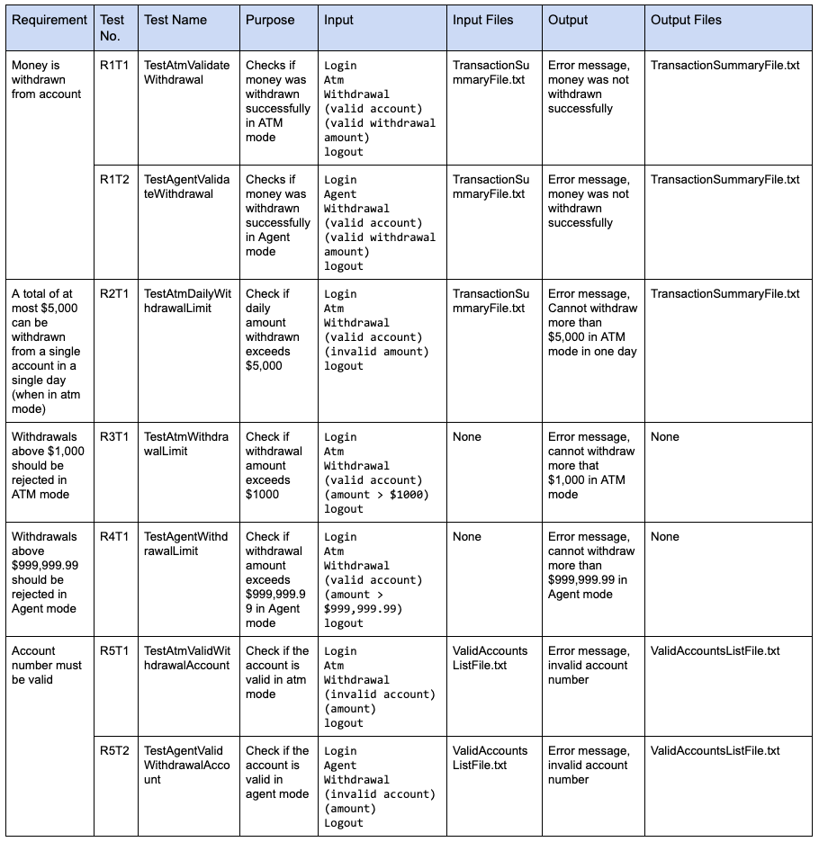
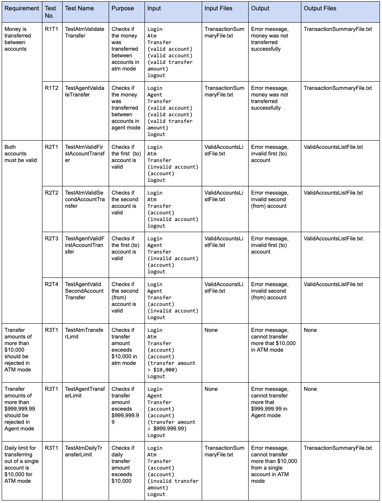

# Front End Requirements
  [PDF Version](https://github.com/tamirarnesty/bat-quinterac/blob/master/Front%20End%20Requirements%20-%20Assignment%20%231/BAT-Enterprises%20Assignment%20%231.pdf)

## Login - Test Cases
---------------------

  

## Logout - Test Cases
----------------------

  

## Create Account - Test Cases
------------------------------

  

## Delete Account - Test Cases
------------------------------

  

## Deposit - Test Cases
-----------------------

  

## Withdraw - Test Cases
------------------------

  

## Transfer - Test Cases
-------------------------

  

## Valid Accounts List File - Test Cases
----------------------------------------

  

## Transaction Summary File - Test Cases
----------------------------------------

  
  

## Test Plan
------------
To run our tests, we will be using the unittest module that is built into python. All of our tests will be in their respective subdirectories within the test/ directory. For example, the tests for login will have the path /tests/test_login/. Within each subdirectory, there will also be a directory for the logs (i.e tests/test_login/logs/<date of test>.txt). To run our tests, we will write a script within the tests/ directory that will execute all of the tests and put their output in their respective log files. Since the project has quite a few unit tests, having the results put in a log will prevent the terminal from becoming cluttered, and the test results more readable.
