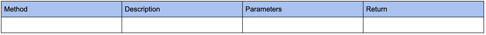
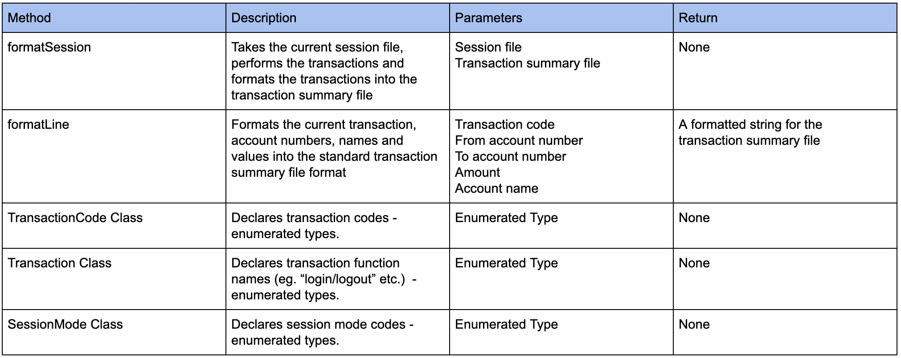
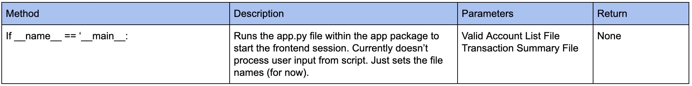
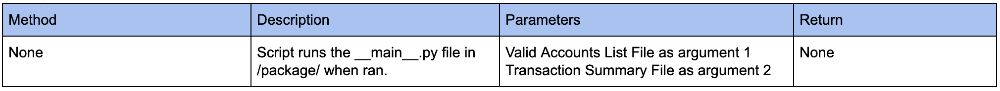

# Front-end Methods
[PDF Version](https://github.com/tamirarnesty/bat-quinterac/blob/master/Front-end%20Methods%20-%20Assignment%20%232/BAT-Enterprises%20Assignment%202.pdf)

## package/app/__init__(dunder).py (empty file)

  

## package/app/formats.py

  

## package/app/app.py

  

## package/__init__(dunder).py (empty file)

  

## package/__main__(dunder).py

  

## package/frontend.sh

  

